# predql-tasks

**predql-tasks** is a repository showcasing examples and workflows for task generation using [*PredQL*](https://github.com/kolesole/PredQL).

## 🔍 Overview

This project provides the logic for generating and evaluating static and temporal relation deep learning tasks. 
It features newly defined tasks based on datasets from [CTU relational](https://relational.fel.cvut.cz/) utilizing [*ReDeLEx*](https://github.com/jakubpeleska/redelex), as well as re-defined standard tasks from [*RelBench*](https://github.com/snap-stanford/relbench). 
Additionally, the repository includes a suite of experiments covering model training, evaluation, and the demonstration of data tables generated via PredQL.

The central goal is to define deep learning tasks (including regression, binary/multiclass/multilabel classification, and link prediction) over relational databases using the SQL-like declarative language *PredQL*, and then apply Graph Neural Networks (GNNs) to solve these tasks.

## 📁 Repository Structure

- [`predql_tasks/`](./predql_tasks/): Contains the core logic for task definition and generation.
  - [`base/`](./predql_tasks/base/): Base classes for defining tasks ([`PredQLBaseTask`](./predql_tasks/base/predql_base_task.py), [`PredQLStatTask`](./predql_tasks/base/predql_stat_task.py), [`PredQLTmpTask`](./predql_tasks/base/predql_tmp_task.py)).
  - [`tasks/`](./predql_tasks/tasks/): Implementations of specific static and temporal tasks.
- [`experiments/`](./experiments/): Contains Jupyter notebooks and scripts for model training and task generation.
  - [`model_training/`](./experiments/model_training/): Scripts and notebooks for training GNNs like SAGE and HGT, including configuration files and utility functions.
  - [`task_generation/`](./experiments/task_generation/): Notebooks demonstrating how to generate tasks over relational databases.

## ⚙️ Task Generation Pipeline

The task generation pipeline is built around several core classes that are designed to be compatible with standard evaluation workflows:

- [**`PredQLBaseTask`**](./predql_tasks/base/predql_base_task.py): A simplified version of the `BaseTask` class from *RelBench*.   
It provides essential methods:
  - [`get_table(split: str)`](./predql_tasks/base/predql_base_task.py#L51): Retrieves the data table for a specific data split ("train", "val", or "test").
  - [`compute_metrics(logits: np.ndarray, labels: np.ndarray)`](./predql_tasks/base/predql_base_task.py#L68): Evaluates the model's predictions against ground-truth labels.
- [**`PredQLStatTask`**](./predql_tasks/base/predql_stat_task.py): A specialized class for defining static deep learning tasks.
- [**`PredQLTmpTask`**](./predql_tasks/base/predql_tmp_task.py): A specialized class for defining temporal deep learning tasks.

For specific examples of task implementations, check the [`tasks/`](./predql_tasks/tasks/) directory.

## 🦾 Model Training & Experiments

We provide examples of training various GNN architectures on tasks generated by PredQL to demonstrate their effectiveness in solving *Relational Deep Learning* tasks.

### 🧠 Models

We implemented and trained several GNN architectures, including:
- **GraphSAGE** ([`sage_model.py`](./experiments/model_training/training/models/sage_model.py))
- **Heterogeneous Graph Transformer (HGT)** ([`hgt_model.py`](./experiments/model_training/training/models/hgt_model.py))

These GNN models were combined with an **MLP** head for the final prediction and trained using the **AdamW** optimizer for 30 epochs with an early stopping patience of 10.

### ⚙️ Configuration

We aimed to keep the capacity and strength of the different models comparable for a fair evaluation. 

Detailed training configurations can be found in the config file [`config.yml`](./experiments/model_training/notebooks/config.yml).

### 📔 Notebooks

The [`relational_fel.ipynb`](./experiments/task_generation/relational_fel.ipynb) notebook is used to analyze datasets and showcase tables from newly generated tasks.

The [`notebooks/`](./experiments/model_training/notebooks/) directory contains various Jupyter notebooks for testing different task types:
- Temporal Binary Classification ([`relational_fel_bc.ipynb`](./experiments/model_training/notebooks/relational_fel_bc.ipynb), [`relbench_bc.ipynb`](./experiments/model_training/notebooks/relbench_bc.ipynb))
- Temporal Multiclass Classification ([`relational_fel_mcc.ipynb`](./experiments/model_training/notebooks/relational_fel_mcc.ipynb))
- Temporal Multilabel Classification ([`relational_fel_mlc.ipynb`](./experiments/model_training/notebooks/relational_fel_mlc.ipynb))
- Temporal Regression ([`relational_fel_reg.ipynb`](./experiments/model_training/notebooks/relational_fel_reg.ipynb), [`relbench_reg.ipynb`](./experiments/model_training/notebooks/relbench_reg.ipynb))

### 📊 Used Tasks & Results

In this section, we summarize our results across different tasks, ranging from re-defined standard RelBench tasks to new tasks defined on the CTU relational datasets.  

Reported metrics are averaged over 5 independent runs.

<table>
  <thead>
    <tr>
      <th rowspan="3" style="text-align: center;">Task Name</th>
      <th rowspan="3" style="text-align: center;">Task Description</th>
      <th rowspan="3" style="text-align: center;">Tune Metric Name</th>
      <th colspan="7" style="text-align: center; border-left: 2px solid grey;">SAGE</th>
      <th colspan="7" style="text-align: center; border-left: 2px solid grey;">HGT</th>
    </tr>
    <tr>
      <th colspan="3" style="text-align: center; border-left: 2px solid grey;">loss</th>
      <th colspan="3" style="text-align: center;">tune_metric</th>
      <th rowspan="2" style="text-align: center;">plot</th>
      <th colspan="3" style="text-align: center; border-left: 2px solid grey;">loss</th>
      <th colspan="3" style="text-align: center;">tune_metric</th>
      <th rowspan="2" style="text-align: center;">plot</th>
    </tr>
    <tr>
      <th style="text-align: center; border-left: 2px solid grey;">train</th>
      <th style="text-align: center;">val</th>
      <th style="text-align: center;">test</th>
      <th style="text-align: center;">train</th>
      <th style="text-align: center;">val</th>
      <th style="text-align: center;">test</th>
      <th style="text-align: center; border-left: 2px solid grey;">train</th>
      <th style="text-align: center;">val</th>
      <th style="text-align: center;">test</th>
      <th style="text-align: center;">train</th>
      <th style="text-align: center;">val</th>
      <th style="text-align: center;">test</th>
    </tr>
  </thead>
  <tbody>
    <tr style="text-align: center;">
      <td><a href="./predql_tasks/tasks/predql_tmp_tasks.py#L217"><code>F1 Driver DNF (RelBench)</code></td>
      <td>
        For each driver predict if they will DNF (did not finish) a race in the next 1 month (Binary Classification)
      </td>
      <td>Accuracy</td>
      <td style="border-left: 1px solid grey;">0.2530 ± 0.0046</td>
      <td>0.5000 ± 0.0180</td>
      <td>0.7592 ± 0.0506</td>
      <td>0.8693 ± 0.0066</td>
      <td>0.8026 ± 0.0052</td>
      <td>0.7219 ± 0.0123</td>
      <td>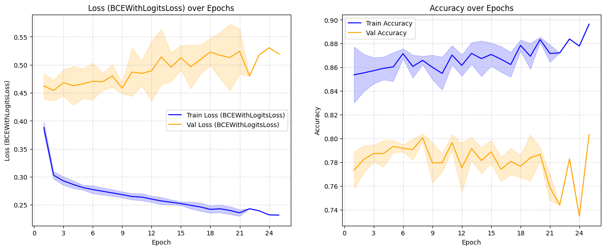</td>
      <td style="border-left: 1px solid grey;">0.2678 ± 0.0277</td>
      <td>0.5138 ± 0.0574</td>
      <td>0.8183 ± 0.1450</td>
      <td>0.8716 ± 0.0092</td>
      <td>0.7996 ± 0.0089</td>
      <td>0.6932 ± 0.0138</td>
      <td>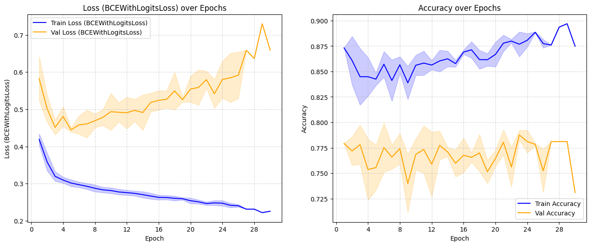</td>
    </tr>
    <tr style="text-align: center;">
      <td><a href="./predql_tasks/tasks/predql_tmp_tasks.py#L256"><code>F1 Driver Position (RelBench)</code></td>
      <td>
        Predict the average finishing position of each driver across all races in the next 2 months (Regression)
      </td>
      <td>MAE</td>
      <td style="border-left: 1px solid grey;">5.1403 ± 0.1808</td>
      <td>2.9798 ± 0.0803</td>
      <td>3.9138 ± 0.0819</td>
      <td>5.1403 ± 0.1808</td>
      <td>2.9798 ± 0.0803</td>
      <td>3.9138 ± 0.0819</td>
      <td>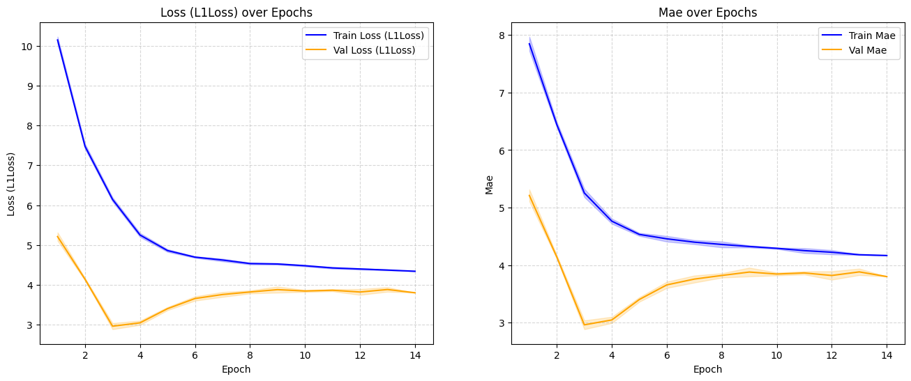</td>
      <td style="border-left: 1px solid grey;">5.4683 ± 0.3659</td>
      <td>3.8292 ± 0.0154</td>
      <td>4.2645 ± 0.0597</td>
      <td>5.4683 ± 0.3659</td>
      <td>3.8292 ± 0.0154</td>
      <td>4.2645 ± 0.0597</td>
      <td>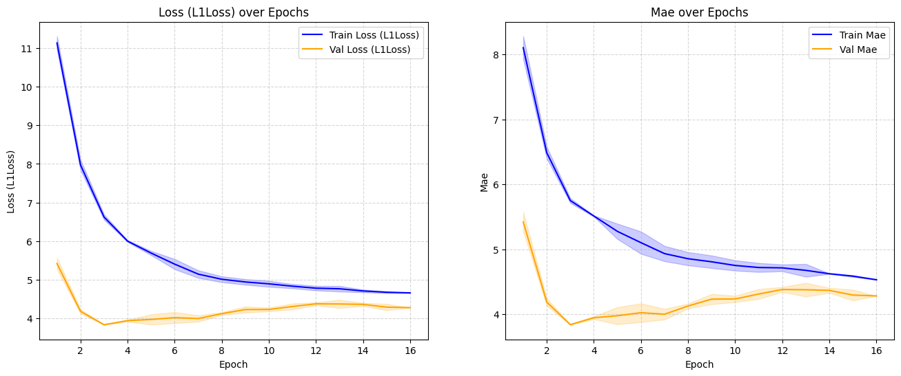</td>
    </tr>
    <tr style="text-align: center;">
      <td><a href="./predql_tasks/tasks/predql_tmp_tasks.py#L129"><code>Seznam Client Out of Wallet</code></td>
      <td>
        Predict whether a client will spend outside their wallet in the next 30 days (Binary Classification)
      </td>
      <td>Accuracy</td>
      <td style="border-left: 1px solid grey;">0.5881 ± 0.0008</td>
      <td>0.4576 ± 0.0062</td>
      <td>0.4574 ± 0.0062</td>
      <td>0.6460 ± 0.0011</td>
      <td>0.9764 ± 0.0016</td>
      <td>0.9768 ± 0.0016</td>
      <td>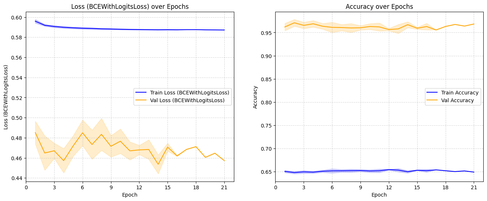</td>
      <td style="border-left: 1px solid grey;">0.5978 ± 0.0024</td>
      <td>0.4656 ± 0.0076</td>
      <td>0.4655 ± 0.0076</td>
      <td>0.6335 ± 0.0000</td>
      <td>0.9868 ± 0.0000</td>
      <td>0.9876 ± 0.0000</td>
      <td>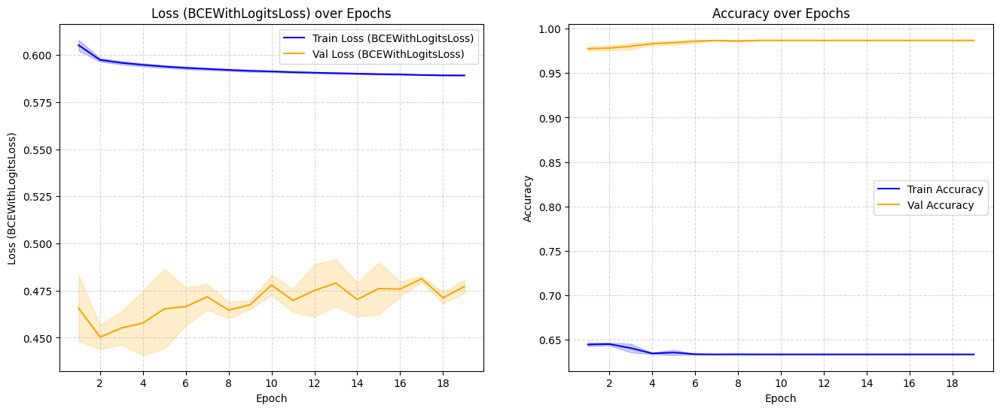</td>
    </tr>
    <tr style="text-align: center;">
      <td><a href="./predql_tasks/tasks/predql_tmp_tasks.py#L172"><code>Seznam Client First Service</code></td>
      <td>
        Predict the first service a client will use in the next 30 days (Multiclass Classification)
      </td>
      <td>Accuracy</td>
      <td style="border-left: 1px solid grey;">0.9361 ± 0.0039</td>
      <td>1.0835 ± 0.0188</td>
      <td>1.0380 ± 0.0155</td>
      <td>0.5698 ± 0.0011</td>
      <td>0.4417 ± 0.0058</td>
      <td>0.4677 ± 0.0056</td>
      <td>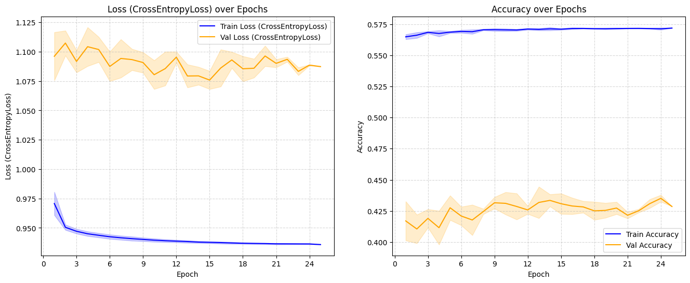</td>
      <td style="border-left: 1px solid grey;">0.9618 ± 0.0061</td>
      <td>1.0858 ± 0.0063</td>
      <td>1.0411 ± 0.0052</td>
      <td>0.5617 ± 0.0028</td>
      <td>0.4364 ± 0.0036</td>
      <td>0.4585 ± 0.0005</td>
      <td>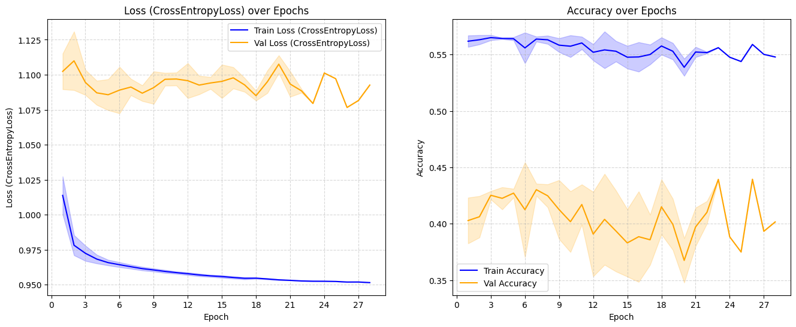</td>
    </tr>
    <tr style="text-align: center;">
      <td><a href="./predql_tasks/tasks/predql_tmp_tasks.py#L151"><code>Seznam Client Services</code></td>
      <td>
        Predict the services a client will use in the next 30 days (Multilabel Classification)
      </td>
      <td>AUPRC Micro</td>
      <td style="border-left: 1px solid grey;">0.2174 ± 0.0003</td>
      <td>0.2437 ± 0.0012</td>
      <td>0.2414 ± 0.0011</td>
      <td>0.6876 ± 0.0009</td>
      <td>0.6217 ± 0.0017</td>
      <td>0.6274 ± 0.0017</td>
      <td>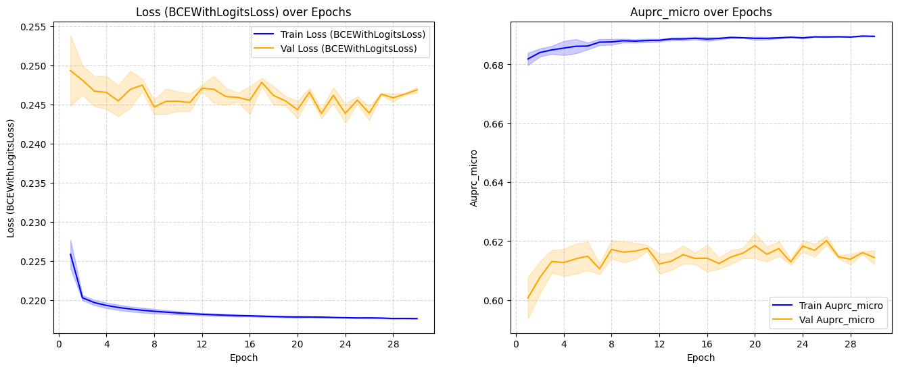</td>
      <td style="border-left: 1px solid grey;">0.2221 ± 0.0009</td>
      <td>0.2496 ± 0.0019</td>
      <td>0.2472 ± 0.0016</td>
      <td>0.6760 ± 0.0021</td>
      <td>0.5929 ± 0.0074</td>
      <td>0.5987 ± 0.0078</td>
      <td>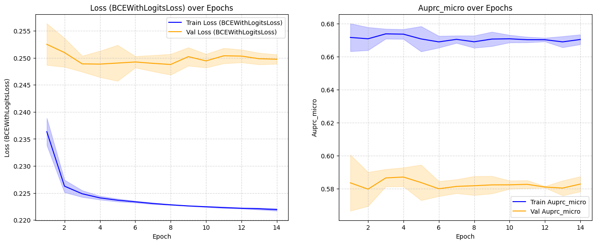</td>
    </tr>
    <tr style="text-align: center;">
      <td><a href="./predql_tasks/tasks/predql_tmp_tasks.py#L193"><code>Seznam Client Spending</code></td>
      <td>
        Predict client spending amount in the next 30 days (Regression)
      </td>
      <td>MAE</td>
      <td style="border-left: 1px solid grey;">9825.7599 ± 3.2644</td>
      <td>8826.1420 ± 1.1119</td>
      <td>9306.8709 ± 1.5437</td>
      <td>9825.7598 ± 3.2643</td>
      <td>8826.1424 ± 1.1119</td>
      <td>9306.8711 ± 1.5433</td>
      <td>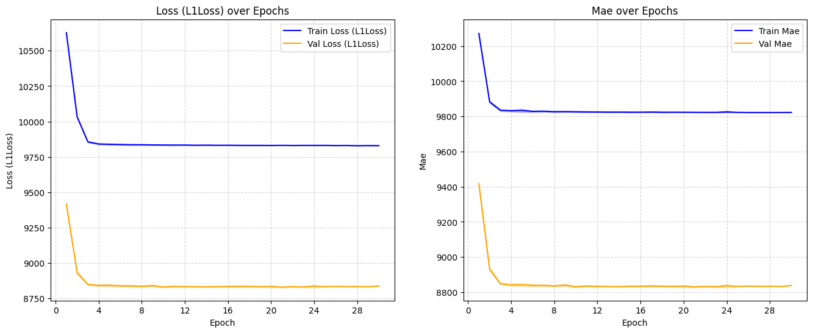</td>
      <td style="border-left: 1px solid grey;">9828.5538 ± 1.8362</td>
      <td>8839.1032 ± 3.0592</td>
      <td>9321.0258 ± 2.8791</td>
      <td>9828.5539 ± 1.8360</td>
      <td>8839.1031 ± 3.0590</td>
      <td>9321.0258 ± 2.8790</td>
      <td>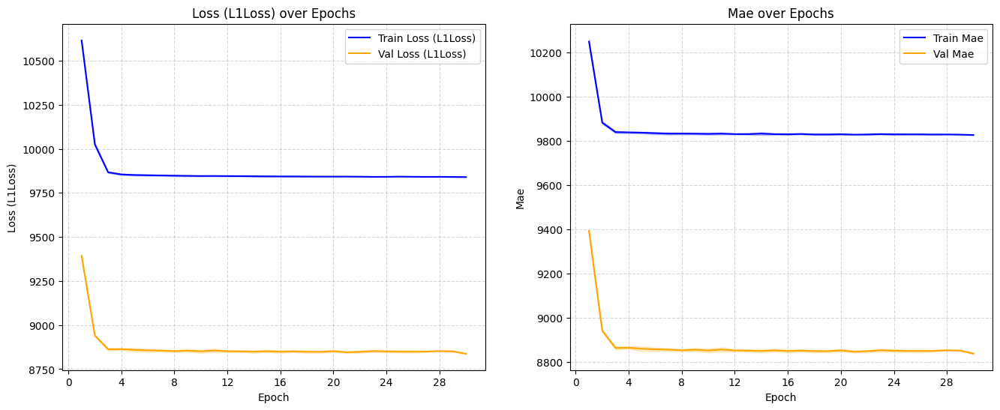</td>
    </tr>
  </tbody>
</table>

## 🔧 Development

### Install uv

- macOS & Linux

```bash
wget -qO- https://astral.sh/uv/install.sh | sh
```

- Windows

```bash
powershell -ExecutionPolicy ByPass -c "irm https://astral.sh/uv/install.ps1 | iex"
```

### Install dependencies

```bash
uv sync --all-extras
```

### Run linter

```bash
ruff check .
```


